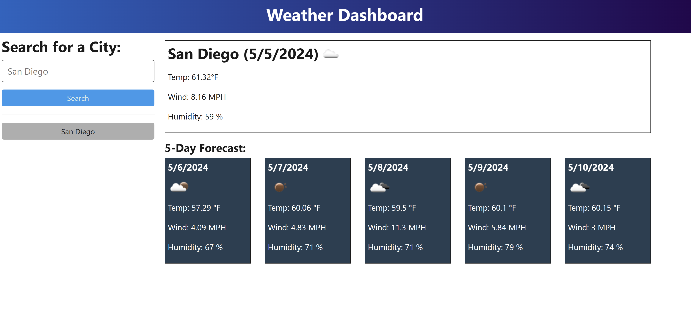
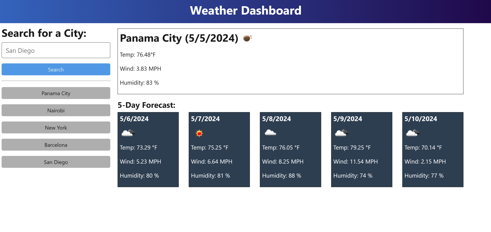
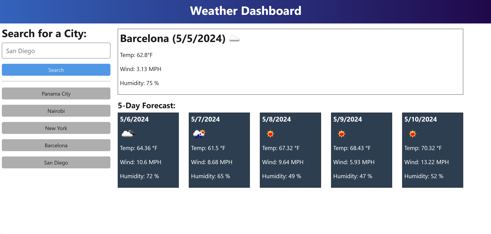

    <!-- PROJECT SHIELDS -->
    
    
    
    
    

 

<h3 align="center">Weather Search Dashboard</h3>

  

    A weather forecast application which displays 5-day forecasts for cities around the globe
     
     
    <a href="https://github.com/sara-hines/weather-search-dashboard"><strong>Explore the docs »</strong></a>
     
     
    <a href="#usage-and-features">View Features</a>
    ·
    <a href="https://github.com/sara-hines/weather-search-dashboard/issues/new?labels=bug&template=bug-report---.md">Report a Bug</a>
    ·
    <a href="https://github.com/sara-hines/weather-search-dashboard/issues/new?labels=enhancement&template=feature-request---.md">Request a Feature</a>
  

 
<!-- TABLE OF CONTENTS -->

  
Table of Contents

  <ol>
    <li>
      <a href="#description">Description</a>
      <ul>
        <li><a href="#built-with">Built With</a></li>
      </ul>
    </li>
    <li>
      <a href="#getting-started">Getting Started</a>
      <ul>
        <li><a href="#installation">Installation</a></li>
      </ul>
    </li>
    <li>
        <a href="#usage-and-features">Usage and Features</a>
    </li>
    <li><a href="#contributing">Contributing</a></li>
    <li><a href="#license">License</a></li>
    <li><a href="#contact">Contact</a></li>
    <li><a href="#acknowledgments">Acknowledgments</a></li>
  </ol>

 

<!-- ABOUT THE PROJECT -->
## Description

This Weather Search Dashboard is a web application that allows travelers to check the current weather conditions and outlook for cities all around the globe. By entering a city name, users can view current and future weather conditions, including temperature, humidity, wind speed, and a 5-day forecast. The dashboard dynamically updates using the OpenWeatherMap API, a high-quality tool which professionals in industries from meteorology, to insurance, to energy, all rely on. The dashboard also stores search history using localStorage, providing a smooth and personalized user experience. Whether you’re planning a trip or just curious about the weather, this dashboard provides essential information at your fingertips.

(<a href="#readme-top">back to top</a>)

### Built With
- [![OpenWeatherMap][OpenWeather]][OpenWeather-url]
- [![DayJs][Day.js]][DayJs-url]
- [![Node][Node.js]][Node-url]
- [![Javascript][JavaScript]][Javascript-url]
- [![VSCode][Visualstudio.com]][VSCode-url]

(<a href="#readme-top">back to top</a>)

<!-- GETTING STARTED -->
## Getting Started

### Installation

This application's main purpose is to fetch, display, and persist weather data from a quality, open-source API; it does not require any installation, dependencies, or prerequisites. Simply navigate to the web page at https://sara-hines.github.io/weather-search-dashboard! 

(<a href="#readme-top">back to top</a>)

<!-- USAGE EXAMPLES -->
## Usage and Features

When the user first opens the page, no weather or city data will initially be displayed. After entering the name of a city in the search tool and clicking the search button, the current weather in the chosen city will be displayed, and a daily forecasts for the next 5 days will appear below the current weather. 

The below screenshot shows the results of a search for San Diego, including a weather icon, temperature, wind, and humidity for each day.

After searching for a city, a button displaying the city's name is rendered below the search tool, and the city name is stored in Local Storage in the browser. The user can click the button for a previously-searched city to retrieve the current weather and forecast for that city once again. 

The below image shows the page's appearance after searching for weather conditions in San Diego, Barcelona, New York, Nairobi, and Panama City. Each of the cities appear in an orderly, interactive search history below the search tool. 

In the below screenshot, the button in the search history for Barcelona was clicked, retrieving current and future weather conditions for Barcelona once again. 

The user's search history will persist in local storage even if the user closes the browser and returns later. This helps to maintain a personalized user experience and adds to the app's usefulness in personal organization and travel planning. 

(<a href="#readme-top">back to top</a>)

<!-- CONTRIBUTING -->
## Contributing

Contributions are what make the open source community such an amazing place to learn, inspire, and create. Any contributions you make are **greatly appreciated**.

If you have a suggestion that would make this better, please fork the repo and create a pull request. You can also simply open an issue with the tag "enhancement".

Don't forget to give the project a star! Thanks again!

1. Fork the Project
2. Create your Feature Branch (`git checkout -b feature/AmazingFeature`)
3. Commit your Changes (`git commit -m 'Add some AmazingFeature'`)
4. Push to the Branch (`git push origin feature/AmazingFeature`)
5. Open a Pull Request

(<a href="#readme-top">back to top</a>)

<!-- LICENSE -->
## License

This project is covered under the MIT License. You can learn more about this license and its coverage and permissions [here](https://opensource.org/licenses/MIT).

(<a href="#readme-top">back to top</a>)

<!-- CONTACT -->
## Contact

If you have any questions/thoughts about this project or would like to connect, you can reach me at https://github.com/sara-hines/ or sara.marie.hines1@gmail.com. I look forward to hearing from you!

(<a href="#readme-top">back to top</a>)

<!-- ACKNOWLEDGMENTS -->
## Acknowledgments

Thank you to [OpenWeather](https://openweather.co.uk/) for providing an expansive, quality and accessible weather data API for scientists, developers, and learners of all kinds!

This README was made from a modified template created by [@othneildrew](https://github.com/othneildrew). View the original [here](https://github.com/othneildrew/Best-README-Template).

(<a href="#readme-top">back to top</a>)

<!-- MARKDOWN LINKS & IMAGES -->

[OpenWeather]: https://img.shields.io/badge/OpenWeather-orange?style=for-the-badge&logo=openweathermap&logoColor=white
[OpenWeather-url]: https://openweathermap.org/api
[Day.js]: https://img.shields.io/badge/Day.js-FF5F4C.svg?style=for-the-badge&logo=day.js&logoColor=blue&color=white
[DayJs-url]: https://day.js.org/
[Node.js]: https://img.shields.io/badge/node.js-6DA55F?style=for-the-badge&logo=node.js&logoColor=white
[Node-url]: https://nodejs.org
[JavaScript]: https://img.shields.io/badge/javascript-%23323330.svg?style=for-the-badge&logo=javascript&logoColor=%23F7DF1E
[Javascript-url]: https://ecma-international.org/publications-and-standards/standards/ecma-262/
[Visualstudio.com]: https://img.shields.io/badge/Visual%20Studio%20Code-0078d7.svg?style=for-the-badge&logo=visual-studio-code&logoColor=white
[VSCode-url]: https://code.visualstudio.com/